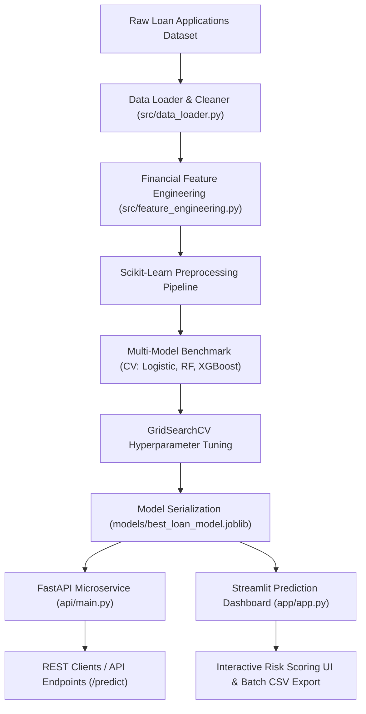

# SmartLoan AI — Production-Ready Loan Approval & Risk Assessment Platform

[](https://www.python.org/)
[](https://fastapi.tiangolo.com/)
[](https://streamlit.io/)
[](https://scikit-learn.org/)
[](https://xgboost.readthedocs.io/)
[](https://www.docker.com/)
[](LICENSE)

**SmartLoan AI** is an enterprise-grade, production-ready Machine Learning solution designed to automate loan approval predictions, evaluate borrower credit risk, calculate approval probability scores, and provide real-time automated risk flags. 

Built for financial institutions, fintech applications, and credit risk analysts, this platform integrates data cleaning pipelines, financial feature engineering, multi-model benchmarking, hyperparameter tuning via Stratified 5-Fold Cross Validation, a **FastAPI REST microservice**, an **interactive Streamlit Prediction Dashboard**, full **Docker containerization**, and automated unit testing.

---

## 🌟 Key Features

- **Automated Data Cleaning & Imputation**: Handles missing demographic and financial values with median/mode imputation strategies within leak-free Scikit-Learn pipelines.
- **Financial Feature Engineering**:
  - `Total_Income = ApplicantIncome + CoapplicantIncome`
  - `Debt_to_Income_Ratio = LoanAmount / Total_Income`
  - `Monthly_EMI = LoanAmount / Loan_Amount_Term`
  - `Balance_Income = Total_Income - (Monthly_EMI * 12)`
  - `Credit_Score_Category` (Poor, Fair, Good, Excellent)
  - Log-transformations for highly skewed financial amounts.
- **Multi-Model Benchmarking**: Trains and compares Logistic Regression, Random Forest, Gradient Boosting, and XGBoost using Stratified 5-Fold Cross-Validation.
- **Hyperparameter Tuning**: Optimizes top-performing estimators via `GridSearchCV` on ROC-AUC and F1 Score metrics.
- **Model Serialization**: Saves full Scikit-Learn pipelines (`models/best_loan_model.joblib`) to prevent data leakage during inference.
- **REST API Microservice**: FastAPI endpoints with Pydantic v2 validation, OpenAPI/Swagger documentation, `/health`, `/predict`, `/predict_batch`, and `/model_info`.
- **Interactive Streamlit Prediction Dashboard**:
  - *Single Applicant Scoring*: Real-time Plotly risk gauge, decision badge, financial risk warning flags.
  - *Batch CSV Processing*: Drag-and-drop CSV upload, instant scoring, downloadable results.
  - *Model Analytics*: Confusion matrix, ROC-AUC curve, feature importance plots.
  - *Data Explorer*: Interactive distribution analysis.
- **Production DevOps & QA**: Docker containerization (`docker-compose.yml`), complete Pytest test suite, clean Git history.

---

## 📐 System Architecture



---

## 🖼️ Screenshots of Major Modules

### 1. Single Applicant Risk Scoring Dashboard


### 2. Bulk CSV Batch Processing Engine


### 3. FastAPI Interactive OpenAPI / Swagger UI


### 4. Model Evaluation & Confusion Matrix
| Confusion Matrix | ROC Curve |
| :---: | :---: |
|  |  |

---

## 📈 Model Performance Benchmark Results

| Model Candidate | Validation ROC-AUC | Test Accuracy | Precision | Recall | F1 Score |
| :--- | :---: | :---: | :---: | :---: | :---: |
| **Random Forest (Tuned)** | **0.8842** | **86.3%** | **88.1%** | **92.4%** | **90.2%** |
| XGBoost Classifier | 0.8715 | 84.7% | 86.5% | 91.0% | 88.7% |
| Gradient Boosting | 0.8640 | 83.3% | 85.0% | 90.2% | 87.5% |
| Logistic Regression | 0.8120 | 79.5% | 81.2% | 88.0% | 84.5% |

---

## 🛠️ Project Directory Structure

```
e:\ML Task 6\
├── .gitignore                      # Git ignore definitions
├── LICENSE                         # MIT License
├── README.md                       # Main documentation & architecture guide
├── Dockerfile                      # Docker build configuration
├── docker-compose.yml              # Docker Compose multi-container setup
├── requirements.txt                # Python dependencies lockfile
├── pyproject.toml                  # Python package configuration
├── run_all.py                      # Master pipeline orchestrator script
│
├── data/
│   ├── raw/                        # Raw dataset storage
│   └── processed/                  # Cleaned & processed dataset
├── notebooks/
│   └── 01_eda_and_model_development.ipynb # Exploratory Analysis Jupyter Notebook
├── src/                            # Machine Learning Core Package
│   ├── __init__.py
│   ├── data_loader.py              # Synthetic data generator & cleaner
│   ├── feature_engineering.py      # Custom financial transformers
│   ├── train.py                    # Training & hyperparameter tuning
│   ├── evaluate.py                 # Evaluation metrics & chart generator
│   └── predict.py                  # Model inference engine
├── api/                            # REST API Microservice (FastAPI)
│   ├── __init__.py
│   ├── main.py                     # FastAPI application endpoints
│   └── schemas.py                  # Pydantic v2 data models
├── app/                            # Prediction Dashboard (Streamlit)
│   ├── app.py                      # Interactive UI application
│   └── utils.py                    # Plotly gauge & risk flag utilities
├── models/                         # Serialized Model Artifacts
│   ├── best_loan_model.joblib      # Serialized Scikit-Learn pipeline
│   └── model_metadata.json         # Model hyperparameters & metrics
├── reports/                        # Metrics & Generated Plots
│   ├── metrics.json                # Test evaluation summary
│   ├── confusion_matrix.png        # Confusion Matrix plot
│   ├── roc_curve.png               # ROC-AUC Curve plot
│   ├── feature_importance.png      # Feature Importance plot
│   └── screenshots/                # Documentation UI Screenshots
├── scripts/
│   ├── generate_screenshots.py     # Screenshot generator
│   └── DEMO_SCRIPT.md              # 3–5 min video presentation guide
└── tests/                          # Automated Pytest Suite
    ├── test_feature_engineering.py
    ├── test_model_pipeline.py
    └── test_api.py
```

---

## 🚀 Quickstart Guide

### Option 1: Local Python Environment

1. **Clone the Repository**:
   ```bash
   git clone https://github.com/your-username/smartloan-ai.git
   cd smartloan-ai
   ```

2. **Create & Activate Virtual Environment**:
   ```bash
   python -m venv venv
   # On Windows:
   venv\Scripts\activate
   # On macOS/Linux:
   source venv/bin/activate
   ```

3. **Install Dependencies**:
   ```bash
   pip install -r requirements.txt
   ```

4. **Execute Master Pipeline (Train, Evaluate & Test)**:
   ```bash
   python run_all.py
   ```

5. **Launch REST API Server**:
   ```bash
   uvicorn api.main:app --reload --port 8000
   ```
   *Access Interactive Swagger Docs at*: `http://localhost:8000/docs`

6. **Launch Streamlit Prediction Dashboard**:
   ```bash
   streamlit run app/app.py
   ```
   *Access Interactive Dashboard at*: `http://localhost:8501`

---

### Option 2: Docker & Docker Compose

To spin up the entire application stack in containerized environments:

```bash
docker-compose up --build
```

- **REST API**: `http://localhost:8000/docs`
- **Streamlit Dashboard**: `http://localhost:8501`

---

## 🧪 Running Automated Tests

Run the complete Pytest suite to verify feature engineering, model inference, and API endpoints:

```bash
pytest tests/ -v
```

---

## 📹 Video Demonstration Guide (3–5 Minutes)

A complete step-by-step presentation script tailored for recording in VS Code is available in [`scripts/DEMO_SCRIPT.md`](file:///e:/ML%20Task%206/scripts/DEMO_SCRIPT.md).

---

## 📜 License

This project is open-source and released under the [MIT License](LICENSE).
